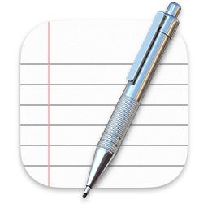
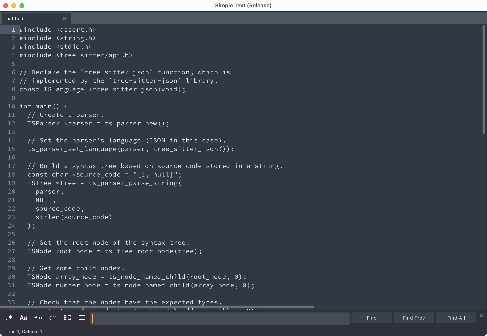

<h1>

  
   Simple Text
</h1>
  

    A GPU-accelerated, cross-platform text editor.
     
    <a href="#about">About</a>
    ·
    <a href="https://github.com/jason5122/simple-text/releases">Download</a>
    ·
    <a href="docs">Documentation</a>
    ·
    <a href="docs/DEVELOPING.md">Developing</a>
  

  

## About

> [!NOTE]
> The app name and icon are a placeholder!

Simple Text is a fast, lightweight text editor written in C++ and OpenGL. The goal of this project is to provide a competitive editing experience to that of VSCode and Zed with a fraction of the code size. It should also be easy to extend and hack on the internals.

Simple Text also doubles as a research project on font rendering, GUI frameworks, computer graphics, and text editing.
