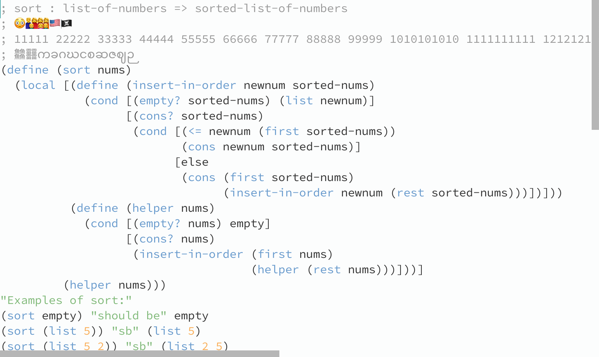

<h1 align="center">Simple Text - A GPU-accelerated, cross-platform text editor</h1>

<p align="center">
  
</p>

## Progress Chart

| Feature              | macOS          | Linux         | Windows          |
| -------------------- | -------------- | ------------- | ---------------- |
| Text Rasterizer      | ✅ (Core Text) | ✅ (FreeType) | ❌ (DirectWrite) |
| Text Shaper          | ✅ (Core Text) | ✅ (HarfBuzz) | ❌ (???)         |
| Window creation      | ✅ (Cocoa)     | 🚧 (GTK)      | ❌ (Win32)       |
| OpenGL context       | ✅             | ✅            | ❌               |
| Keyboard/mouse input | ✅             | ❌            | ❌               |
| Tabs                 | ❌             | ❌            | ❌               |
| Popups/Dialogs       | ❌             | ❌            | ❌               |

## Dependencies

This project uses the GN meta-build system. Binaries are available [here](https://gn.googlesource.com/gn#getting-a-binary).

### macOS

`brew install ninja llvm`

### Fedora

`dnf install gn ninja-build`

## Building

```
gn gen out/Default
ninja -C out/Default
```
